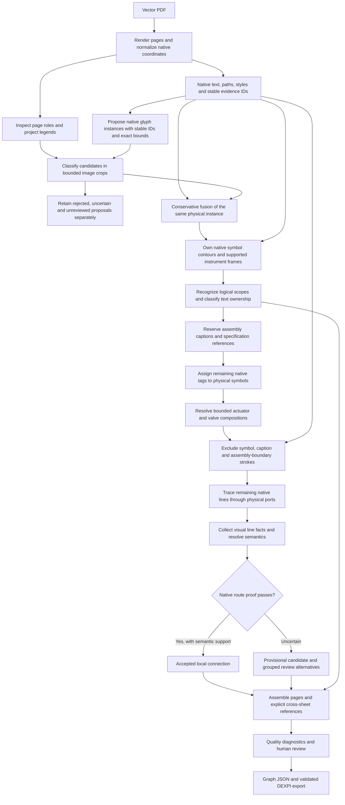
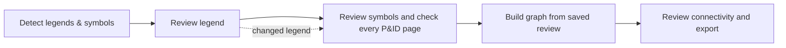

# How vector P&IDs become a connected graph

This guide describes the **evidence-v2 pipeline**, including native hierarchy
ownership introduced in fusion/topology version 4.0.0 and native symbol
perception version 2.1.0. It does not describe the
legacy extraction engine. The objective is to recover physical components,
their printed identities, and supported connections while preserving uncertainty
for review.

## The central rule: decide what the ink belongs to first

A drawing contains several kinds of objects at different levels. Treating every
tag as the name of its closest symbol, or every unbroken stroke as a pipe, loses
that distinction.

| Level | Example | Representation | Can be a pipe endpoint? |
|---|---|---|---|
| Native evidence | PDF text span, circle, frame side, dashed segment | Stable evidence ID and page coordinates | No |
| Physical symbol | Vessel, valve, instrument, off-page connector | Graph node and corroborated native contour | Yes, when a physical port is supported |
| Logical assembly | Compressor package containing several devices | `assemblies`, member node IDs and enclosure evidence | No |
| Text occurrence | Local tag, package caption, specification heading | `text_bindings` and native text inventory | No |
| Connection | Pipe or signal route between physical ports | Graph edge with route evidence | Connects physical nodes |

For example, an underlined `K-101` caption inside a supplier enclosure can name
the compressor package. A valve inside it remains an independent physical node
with its own local tag. The package's rectangle is a scope boundary, and its
membership list does not establish any pipe connections.

## Reconstruction flow



### 1. Preserve the source evidence

The loader renders pages and aligns native PDF geometry with those renders,
including page rotation. Text spans and vector paths retain stable IDs,
coordinates, primitive type, and available stroke/fill/style metadata. Page
inspection separates P&ID sheets from legends and other material. Project
legends inform symbol and line interpretation.

Vector legend extraction starts with whole-page native glyphs and adjacent printed
labels. It excludes long table borders, groups local glyph strokes, and assembles
spaced or multiline captions. A requested crop selects complete source rows by
glyph centre; it does not clip their geometry or labels. Each row retains a stable
`source_row_id`, path/text IDs, glyph bounds and label bounds. Repeated labels at
different locations remain separate. Duplicate observations of one row select a
supported representative crop; conflicting classifications remain uncertain.

Rows are classified in batches of at most 12 with one low-thinking call per batch.
The model supplies meaning and an accept/reject/uncertain decision, but cannot
replace native labels or coordinates. Failed, missing and conflicting decisions
retain source thumbnails and review evidence. Title blocks and numbering examples
can be rejected. The existing bounded detail-region agent remains the raster
fallback. The redundant second attempt at native crop recovery was removed.

`LegendPack.coverage` records source row bounds, decisions and reasons. Partial
rows mark their page partial; partial caches are not reused as complete results.
Completed source rows (including explicit rejections) are reused from matching
partial caches; only unresolved rows need new calls. Repeated failed batches
stop further legend calls. Transport, contract and uninspected failures pause
symbol extraction with all native candidates retained as unreviewed. Valid
semantic ambiguity remains separate from operational failure. Repairing legend
content invalidates dependent symbol results even without a model/version change.
A completed row inventory is not proof of exhaustive coverage: unusual layouts,
very large or unlabelled glyphs, and unsupported abbreviation table headings
still need a source-page check. Deterministic abbreviation tables are retained
separately from graphical definitions.

Rejected native legend rows receive one independent second check of the complete
source glyph and printed definition. Confirmed exclusions and accepted rows are
cached by source-row identity. When a request fails or omits rows, later runs
retry only unresolved rows with matching source and extractor inputs. Repeated
batch failures stop legend inference, and failed or uninspected legend coverage
blocks symbol inference until recovered. A changed legend invalidates dependent
symbol checkpoints, including when the extractor version stays the same.

Raw symbol perception receives relevant graphical definitions rather than a
prefix of the legend pack. Selection is deterministic and balanced across the
candidate shape families: up to 32 definitions, 12 glyph images and 16 exact
local abbreviation matches. Source rows take priority over built-in fallbacks.
Images are appended to the existing perception call, with reference IDs in the
candidate table. No extra symbol-classification call is added. Uncertain source
rows stay in the review bundle but do not act as interpretation rules; explicitly
confirmed review inputs can be used in the graph build. Saved detections record
which references were supplied, not an unverified claim of a particular match.

A visible continuation glyph matching the project convention can be detected
without knowing its destination sheet or seeing the literal words “TO SHEET”.
Unknown direction and drawing references remain absent. Accepting the endpoint
does not establish a cross-sheet edge. Likewise, a small function bubble inside
a vessel is classified from its own glyph, rather than inheriting the vessel class.

Native evidence is retained through later decisions. An extracted label or
connection can therefore be traced back to specific source text or strokes.

### 2. Localize native glyphs, then classify physical instances

On vector pages, Python first proposes local symbol footprints independently of
the model: round symbols and instrument frames, paired-triangle or crossed-stroke
valve bodies, valves with corroborated round seats, capsule bodies, bounded frames
with external ink contacts, and explicit continuation-arrow outlines. The rules use native paths and scale-relative shape
checks. A tag alone cannot create a candidate. A circle/frame shares one instance
only when nearly identical bounds and source strokes support that interpretation.
Distinct locations keep distinct IDs even when their tags repeat.
Explicit closed PDF paths remain available even if nearby/duplicated strokes
confuse the face traversal. Instrument frames include native diamonds. Short
attached strokes can be peeled off a closed circle without bridging gaps;
recovered branched circles require internal function text so valve seats and
filled flow arrows do not become extra independent symbols.

Each crop supplies the clean source image alongside a view with blue candidate
markers, plus stable IDs, native geometry and local text. Python assigns each
candidate to one crop before calling the model. The model does not recheck crop
ownership or replace native coordinates.

The model returns **one `candidate_results` row per ID**: `symbol` with typed
classification, a specific `reject_text_only`, `reject_line`, `reject_annotation`,
or `reject_no_glyph` decision about the candidate's own ink, or
`uncertain` with a reason. A classification cannot carry another ID or a box;
a negative outcome cannot also contain a classification. Duplicate IDs, malformed
outcomes and unknown IDs remain uncertain/reviewable, rather than selecting the
last answer or discarding other valid symbols. Non-symbol evidence is limited to
text, lines, borders/annotations or the absence of a distinct glyph. Assembly
membership, missing tags, small size and graph connectivity are not rejection
criteria. A visible attached motor, isolation valve or distinct actuator is a raw
observation; composition and graph eligibility belong to later stages.

Python retains full page-space geometry, including clipped portions. Old saved
object/disposition lists remain readable through the compatibility decoder, but
are no longer advertised in the tool schema. Conflicting or skipped outcomes
receive at most one targeted repair call for those IDs, retaining good detections
and the original review evidence. Format recovery and candidate repair share the
two-call limit. Capsule geometry alone does not imply a vessel subtype.

The provider-facing schema is flat: each row carries `candidate_id`, `decision`
and optional classification fields directly. It uses no conditional schemas,
unions or references. Python enforces mutually exclusive outcomes and still reads
the older nested format for replay. This avoids relying on a provider to combine
branch properties with common candidate-ID fields.

Every crop starts with reasoning disabled and **6,000 tokens**. **Enabled** permits
one targeted reasoning check, with low effort and **16,000 tokens**, for valid
uncertain/rejected native candidates, geometry conflicts, and rounded equipment
bodies whose family cannot be established by geometry alone. Up to four enlarged
source details accompany the bounded recheck. Broken or missing fields use a short non-reasoning
repair instead. **Automatic** and **Disabled** never add semantic reasoning checks.
Legend extraction retains its existing policy. Failed second attempts leave the
first-pass evidence available for review; there is no third call.

`Config.symbol_perception` controls the limits: short requests have a 45-second
budget, reasoning requests 120 seconds, each with at most two transport attempts
inside that budget. Stream deadlines are checked between events; stalled reads
are capped at 15 seconds, so a blocked read can overrun the deadline by that much.
The stage stops after 30 minutes, three consecutive failed crops or five total
failed crops. A crop fails the native response contract when at least half its
candidates lack usable ID-bound decisions. Valid uncertainty and non-symbol
decisions are not failures. Empty candidate crops do not reset the failure streak.

An early stop preserves completed crops and emits `perception.stop.json`; pending
candidates remain explicitly unreviewed. It also prevents downstream graph/export
work. Per-attempt logical requests (with image fingerprints instead of base64),
structured responses, usage, transport attempts, retry delays and failures are saved in
`checkpoints/perception_diagnostics/`. Reasoning text is represented by its length
and hash; it cannot substitute for structured symbol records.

Freehand boxes for symbols absent from the native candidates are preserved as
**unanchored proposals**, not emitted into fusion as physical graph endpoints.
This prevents a plausible label or guessed off-page connector from certifying
connectivity. Scanned pages retain the existing coordinate-based perception
path. The coordinate parser also distinguishes actual clipping from harmless
floating-point roundoff.

Every owned candidate gets a selected, rejected, uncertain or unreviewed status.
Omission is not rejection. Candidate bounds, path IDs and decisions are saved in
perception checkpoints and `perception.review.json`. New runs also save
`detection.json`, the immutable input to the dedicated legend and symbol review
screen. Model decisions remain evidence; human confirmation is separate.
Unanchored/open/composite symbols still need review or additional native proposal
rules. Ordinary successful crops use one model call; a targeted recovery can use
one additional call. With reasoning enabled, a rejected native candidate can be
rechecked against enlarged source ink; accepting it still requires a valid new
classification compatible with that candidate's own geometry.

Crop detections are observations, not independent engineering objects. Fusion
requires symbol overlap or a shared local vector footprint, compatible geometry
and identity, and compatibility across the cluster. Matching text, containment,
or proximity alone does not justify merging two symbols. Repeated tags in
spatially distinct layouts remain separate instances.

The selected instance keeps a supported representative box. Clipped observations
can combine only when native evidence establishes continuity. Unproven duplicate
matches remain review candidates. Fusion does not compose an actuator and valve;
the existing contextual-symbol stage handles that bounded decision separately.

For instrument symbols, a corroborated four-sided frame is owned together with
the inner contour. Three vertically aligned instrument frames must not turn into
one dashed signal line. Only the actual owned strokes are excluded; the entire
interior of a bounding box is not erased.

### 3. Separate assembly names from component tags

The native hierarchy pass runs before native tag promotion. Its current rules
look for:

1. A closed, axis-aligned, patterned enclosure supported by native segments.
2. At least two contained physical symbols with native contours.
3. Supplier, package, skid or scope wording on the page.
4. An underlined equipment caption inside, or immediately below, the enclosure,
   outside physical glyphs and without a direct native leader to a component.

A continuous solid piping loop, a small instrument frame, or containment alone
does not establish a package. Missing enclosure sides are not invented.

An underlined tag with an adjacent description outside symbols and enclosures
can be a specification heading. A heading above and aligned with a scope is
retained as a reference to that scope. Matching names support its identity;
contradictory names are preserved as one assembly identity conflict. A collective
`A/B` heading may refer to separate `A` and `B` instances without combining them.
Several captions within one shared supplier enclosure remain an uncertain scope;
their different names do not by themselves establish a printed contradiction.

Supported assemblies retain member IDs, boundary segments, caption and heading
IDs, candidate names, and any parent assembly. Nested membership does not merge
physical nodes. Contextual actuator composition updates those member IDs when
an absorbed glyph becomes part of its valve.

Assembly-owned captions are withheld from component labels and the nearest-tag
assignment pool. Unsupported scope-like captions remain unresolved ownership
candidates. A detection consisting only of a specification heading is removed
only when no native glyph corroborates it. The change does not automatically
correct every component classification previously inferred from a misleading tag.

### 4. Reconstruct connections from the remaining ink

Topology excludes owned symbol strokes, assembly boundary segments and caption
underlines from line candidates. It then reconstructs native runs, ports,
nozzle/flange chains, crossings, junctions and arrowheads. Available project
legend information informs line styles.

A route must have distinct physical endpoints, supported contacts and traceable
native segments. A detection box touching a line is insufficient. Native arrow
evidence establishes direction; unknown direction remains unknown.

The structural gate also rejects routes that traverse owned non-connective
strokes. A real pipe crossing a package boundary perpendicularly remains valid;
following that boundary as if it were a pipe does not. This is a segment-level
rule, not a ban on paths entering an assembly's bounding box.

Visual line evidence and semantic reasoning classify or resolve bounded route
candidates. Model confidence cannot override failed geometric proof. Unsupported
alternatives remain provisional, with evidence and reasons. Alternatives in one
native network share a route review decision where appropriate; distinct
supported ports remain separate.

### 5. Assemble, review and export

Local page graphs are combined with explicit off-page reference matches.
Assembly identity is additive metadata alongside physical nodes and edges.
Assemblies never acquire synthetic pipe ports or become large replacement nodes.

The review queue contains assembly decisions with their candidate names and
member components. Selecting an assembly highlights its boundary and members.
Choosing its name resolves linked identity conflicts in one undoable action.
Its caption and specification mentions do not each demand another physical-tag
decision. Approving or rejecting an assembly does not approve or delete its
components or connections. Repeated local tags are compared within assembly
membership scopes when reporting duplicate identities.

`graph.json` and `graph.reviewed.json` preserve assembly and text-binding
metadata. The current DEXPI builder exports physical equipment and supported
connections; it does **not** yet serialize logical assemblies as DEXPI package
entities. Provisional connections are excluded until an explicit review decision
accepts them. XML and semantic validation remain separate correctness checks.

## What the measurements mean

Report accepted connectivity separately from provisional candidates. Isolation
on accepted edges describes usable connectivity; counting provisional edges can
hide gaps. Object counts, edge counts, confidence and review queue size are not
accuracy scores. Fewer review items can result from grouping one decision, and
more items can result from exposing a previously silent error.

Use reviewed instances to measure false merges and duplicate retention. Use
reviewed endpoint pairs and original native paths to evaluate topology separately
from perception. Inspect source diagrams for representative failures. This
ownership change does not resolve missing detections, truncated model responses,
every unsupported port, or contradictions printed in the source itself.

## Review symbols before building connectivity

The Evidence v2 web workflow has three explicit stages:



**Detect legends & symbols** runs native inspection, legend resolution and raw
perception, then stops. It saves native evidence, `legend.json`, `detection.json`,
perception checkpoints, costs and a result summary. It produces no `graph.json`
or DEXPI. Full extractions also save the same detection bundle for later review.
Runs made before this feature need a detection run to create that bundle; their
existing graph reviews remain available.

The dedicated review shows the source drawing with page-coordinate boxes, legend
source crops, detected symbols, native candidates and unanchored proposals. It
includes source-detail crops re-rendered from vector strokes, and supports
changing tags, kinds, classes and bounds, rejecting false detections or
duplicates, and drawing a box to add a missed symbol. Bulk actions affect only the
displayed, explicitly selected set. All P&ID pages require a visual coverage check,
including pages where perception was incomplete. A page check acknowledges the
reviewer's inspection; it is not an automated accuracy score.

The review screen supports English and Chinese and shares the language preference
with the workbench. Selecting an item switches to its source page and, by default,
centers and zooms its bounds. A magenta outline with a white halo distinguishes the
selection from other review statuses. The same bounds appear in a native-resolution
source-detail view. Automatic focus can be disabled; **Focus selected** and
**Fit page** remain available. Changing language retains unsaved field edits.
Legend filters distinguish source graphic examples, text definitions and library
references; references without source coordinates never receive an invented PDF
highlight. These display changes do not alter saved extraction or review decisions.

Decisions persist in `review/detection.json`, with a monotonic revision, reviewer,
time and action history. The preceding state supports one-step undo. A stale
browser revision cannot overwrite newer edits. Editing or excluding a legend
entry flags all previously confirmed symbols for individual classification
review, since reliable per-symbol legend dependencies are not yet available.
The saved drawing hash and detection-bundle hash prevent mixing corrections with
changed source inputs.

**Build graph…** returns to the workbench's model settings. **Build reviewed graph**
freezes the current review in a new run's `reviewed.inputs.json`. All pending
legend/symbol decisions and page coverage checks must be resolved first. The
build reuses native page evidence and reviewed legend/symbol records, skips legend
and perception model calls, and runs topology, line evidence, graph reasoning and
export. Reviewed records represent physical instances: automatic fusion,
contextual composition and native OPC synthesis cannot merge them, replace their
boxes/classes/tags or restore rejected candidates. Assembly context is retained.
Connectivity remains independently reviewable and may require model calls.

Review snapshots are included in checkpoint identity. A later extraction cannot
accidentally resume derived checkpoints from another review revision. The original
detection run is retained and further corrections require another graph build.

## Reuse and validation

Current behavior markers are `symbol_perception: 2.1.0`, `legend_extraction: 3.0.0`, `object_fusion: 4.0.0`, `port_topology: 4.0.0`,
native scene `2.0.0`, and `page_graph_pipeline: 2.0.0`. Derived contextual,
topology, line-evidence, semantic graph, assembly and export checkpoints are
invalidated as required. A symbol-perception version change also invalidates
raw perception, while retaining compatible native evidence and page/legend
inspection. Legend extraction changes also invalidate dependent perception and
its own versioned legend cache. Learned line profiles are keyed to the actual
legend definitions, so retaining native inspection cannot reuse a stale profile.
A fusion-only upgrade retains compatible perception.
The hierarchy and frame-ownership processing is deterministic and adds no
model calls; rerunning downstream contextual/semantic stages can still call
models as part of the existing pipeline.

Restart the running web workbench and run **Detect legends & symbols** again
with compatible evidence reuse to validate this upgrade. Keep the source and extraction
configuration consistent. A fresh setting or configuration mismatch prevents
reuse. Opening only the review screen loads the existing graph; it cannot apply
new detection, fusion or topology logic to that graph. After this perception
upgrade, an extraction rerun is required. Compatible evidence reuse will still
make new perception calls because the old raw checkpoints are invalidated.

Offline checks, run from the repository root, do not call models or overwrite
the source run:

```bash
.venv/bin/pytest tests/unit/test_native_hierarchy.py tests/unit/test_instance_matching.py \
  tests/unit/test_native_scene.py tests/unit/test_port_topology.py \
  tests/unit/test_contextual_symbols.py tests/unit/test_review_core.py \
  tests/unit/test_native_legend_rows.py tests/unit/test_legend_context.py

.venv/bin/python scripts/evaluate_fusion.py \
  --run-dir runs/<drawing>/<run> --out tmp/fusion-audit

.venv/bin/python scripts/evaluate_topology.py \
  --run-dir runs/<drawing>/<run> \
  --objects tmp/fusion-audit/objects.replayed.json --out tmp/topology-audit
```

Both replay tools also exercise the `dexpi-reference` and `tennessee1` vector
fixtures. The fusion fixture check duplicates reviewed boxes with slight jitter;
it measures duplicate fusion, not full extraction accuracy. The topology replay
reports structural candidates, not a new semantically accepted final graph.

To measure native symbol proposal coverage without model calls:

```bash
.venv/bin/python scripts/evaluate_symbol_perception.py \
  --run-dir runs/<drawing>/<run> --audit-dir output/detection-audit \
  --out output/symbol-perception-validation
```

This compares proposals with reviewed glyph bounds and runs both public vector
fixtures. It does not estimate final model accuracy. Some public annotations
include actuator or label extents, so their IoU scores are not directly comparable
with body-only annotations. Independent body checks cover the public fixtures'
crossed-stroke and seated valve variants.

## Current limits and extension points

Scope recognition currently supports axis-aligned patterned enclosures,
underlined captions, a bounded vocabulary of scope notes, and direct native
leaders. Arbitrary polygons, broken enclosures, complex leader chains and other
caption conventions need additional evidence rules. Scope notes are page-level
corroboration, not proof of a particular enclosure's meaning. Specification
association uses layout evidence and remains reviewable. Instrument decoration
ownership currently covers corroborated rectangular frames, not every possible
project-specific glyph decoration.

Extend these evidence rules with drawing-independent regressions before making
them more permissive. Preserve unknown ownership rather than forcing the nearest
symbol to carry a name or forcing every stroke into a connection.

| Responsibility | Main implementation |
|---|---|
| Pipeline and checkpoint orchestration | `src/diagex/extractors/pid_evidence.py` |
| Native PDF evidence | `src/diagex/vision/evidence.py` |
| Native symbol proposals and bounded model classification | `src/diagex/vision/symbol_candidates.py`, `perception.py` |
| Instance matching and fusion | `src/diagex/vision/instance_matching.py`, `fusion.py` |
| Symbol contours, frames and arrow geometry | `src/diagex/vision/vector_geometry.py` |
| Assemblies, specification references and ownership | `src/diagex/vision/native_hierarchy.py` |
| Contextual actuator composition | `src/diagex/vision/contextual.py` |
| Native route construction and structural gate | `src/diagex/vision/topology.py` |
| Semantic page decisions | `src/diagex/vision/page_graph.py` |
| Text coverage and quality diagnostics | `src/diagex/vision/native_text.py`, `quality.py` |
| Legend/symbol review and staged web workflow | `src/diagex/review/detection.py`, `src/diagex/web/` |
| Review actions, persistence and UI | `src/diagex/review/core.py`, `static/` |
| Physical DEXPI build and validation | `src/diagex/extractors/dexpi_builder.py` |
